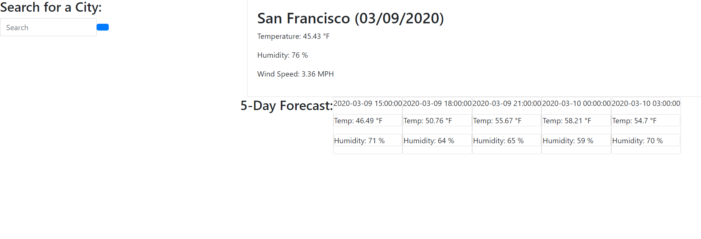

# Weather Dashboard

Weather Dashboard, an app that allows user to enter a city and display current weather condition such as date, temperature, humidity, and wind speed. The app also shows the upcoming five day forecast.

## Built With

- [HTML](https://developer.mozilla.org/en-US/docs/Web/HTML)
- [CSS](https://developer.mozilla.org/en-US/docs/Web/CSS)
- [Javascript](https://developer.mozilla.org/en-US/docs/Web/JavaScript)
- [OpenWeatherMap](https://openweathermap.org/)
- [Moment.js](https://momentjs.com/)

## Installation Guide

## Demo



## Code Snippets

AJAX call to Open Weather Map for current weather

```js
$.ajax({
  url: queryURL,
  method: "GET"
}).then(function(data) {
  console.log(data);

  var date = moment().format(" (MM/DD/YYYY)");
  var temp = data.main.temp;
  var hum = data.main.humidity;
  var wind = data.wind.speed;
  console.log(temp, hum, wind);

  var currentCity = $("<h2>").text(data.name + date);
  var tempEl = $("<p>").text("Temperature: " + temp + " °F");
  var humEl = $("<p>").text("Humidity: " + hum + " %");
  var windEl = $("<p>").text("Wind Speed: " + wind + " MPH");
  var UV = "";

  var currentContainer = $("<div class='current'>");
  currentContainer.append(currentCity, tempEl, humEl, windEl);
  $("#today").append(currentContainer);
});
```

AJAX call to Open Weather Map for 5-Day-Forecast

```js
$.ajax({
  url: queryURLforecast,
  method: "GET"
}).then(function(data) {
  console.log(data.list[3]);

  var forecast = data.list;
  for (var i = 0; i < 5; i++) {
    var forecastDate = data.list[i].dt_txt;
    var forecastTemp = data.list[i].main.temp;
    var forecastHum = data.list[i].main.humidity;
    console.log(forecastDate, forecastTemp, forecastHum);
    // }

    var forecastDateEl = $("<p class='card-title'>").text(forecastDate);
    var forecastTempEl = $("<p class='card text'>").text(
      "Temp: " + forecastTemp + " °F"
    );
    var forecastHumEl = $("<p class='card text'>").text(
      "Humidity: " + forecastHum + " %"
    );

    var forecastContainer = $("<div class='card'>");
    forecastContainer.append(forecastDateEl, forecastTempEl, forecastHumEl);
    $("#fiveDayForecast").append(forecastContainer);
  }
});
```

## Deployed Link

- [See Live Site](https://kokevin678.github.io/weather_dashboard/)

## Authors

**Kevin Ko**

- [LinkedIn](https://www.linkedin.com/in/kevin-ko-ab7a98196/)
- [Github](https://github.com/kokevin678)
- [Portfolio](https://kokevin678.github.io/responsive-portfolio/)
